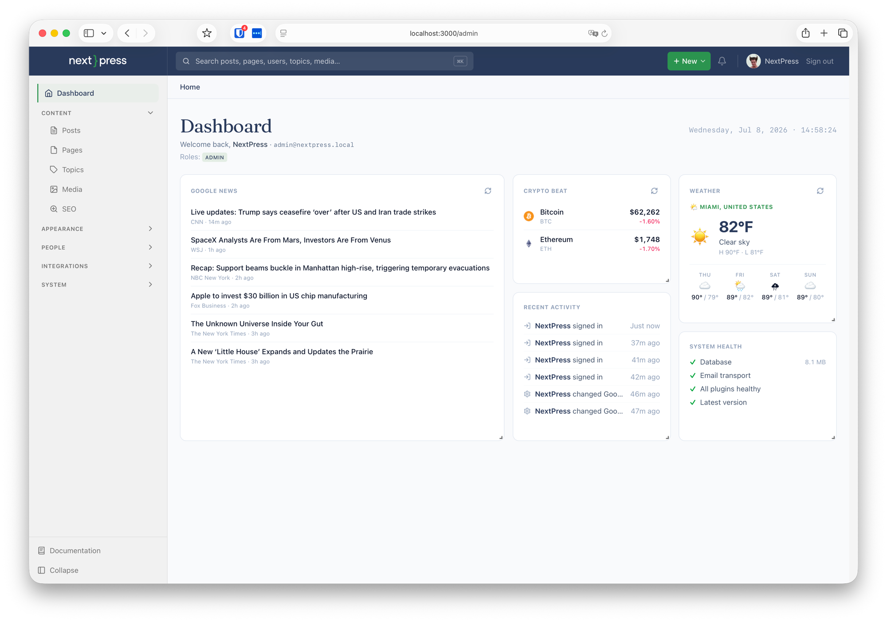
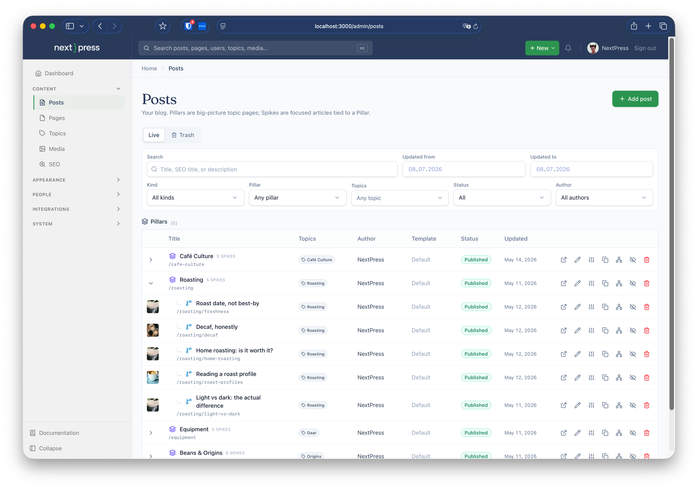
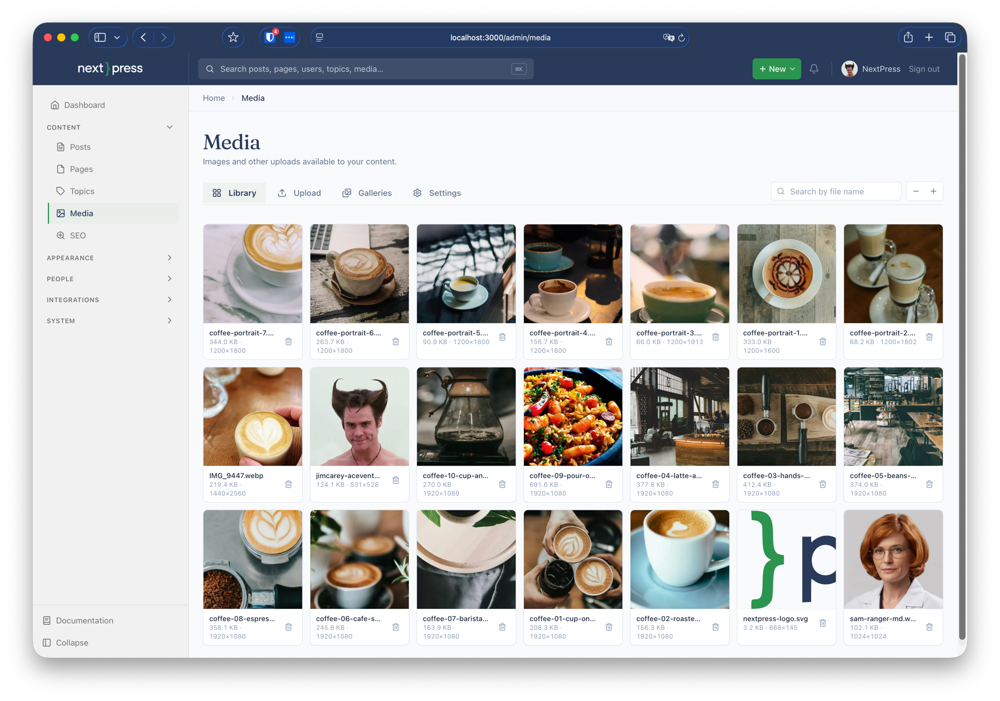
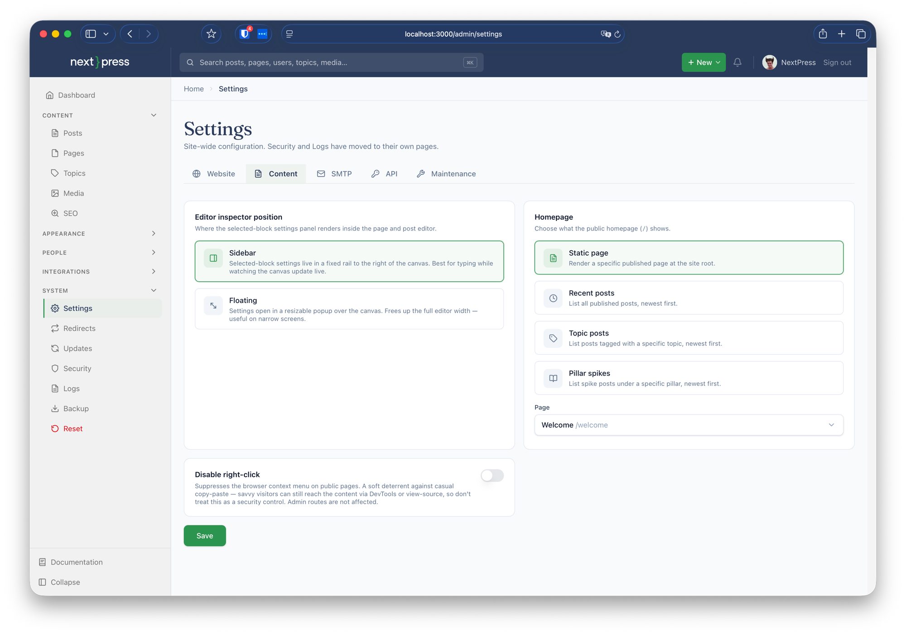

<p align="center">
  
</p>

<h1 align="center">NextPress v1.6</h1>

<p align="center">
  <strong>Built sharp. Stays sharp.</strong><br>
  <em>The publishing engine you run yourself — the CMS mental model you already know,<br>rebuilt server-first on Next.js. No PHP. No plugin roulette. No Tuesday outages.</em>
</p>

<p align="center">
  <a href="https://github.com/drewaltukhov/nextpress-engine/actions/workflows/ci.yml"></a>
  
  
  
  
  <a href="LICENSE"></a>
</p>

<p align="center">
  
</p>

NextPress keeps everything you love about the classic CMS workflow — posts,
taxonomies, hooks, plugins, themes — and throws away everything you don't. It's the
familiar publishing model, rebuilt for an era where **speed, type safety, and SEO survival** are
non-negotiable: server-first rendering, a typed plugin contract, and SEO baked
into the bones instead of sold as a subscription. One repo. One deploy. Your data.

## ✨ Features

### 📝 Content

- **Posts &amp; Pages** with block-based bodies — a visual editor (Puck + Tiptap) with drag-and-drop hero sections, galleries, and FAQ accordions
- **Pillar &amp; Spike content model** — topical clusters where one overview "Pillar" links its focused "Spike" articles automatically, driving internal linking and sitemap structure
- **Topics &amp; taxonomies**, author profiles, RSS, and full-text search out of the box
- **Media library** — uploads, galleries, WebP conversion, and swappable storage (DB blobs by default, or Cloudflare R2)
- **Menus &amp; mega-menus** — structured navigation without a theme rebuild

<p align="center">
  
</p>

### 🔍 SEO — core, always-on

- Sitemaps, structured data (schema.org), `robots.txt`, RSS, and canonical URLs — **built in, even when every optional plugin is disabled**
- Per-post/-page meta, Open Graph &amp; Twitter cards, and topic landing pages
- A redirects manager for slug-rename continuity
- SEO ships in an **essential-tier plugin that loads even if everything else fails**

### 🔒 Security — the baseline, not a bolt-on

- Brute-force **account lockout**, **IP &amp; country blocking**, and a hideable admin path
- **Step-up re-authentication** for sensitive actions
- **Append-only audit log** + failed-login forensics
- Encrypted credentials at rest and secret redaction in logs

### 🎨 Themes &amp; editing

- Visual **theme builder** — customize templates, fonts, and colors in the browser
- Reusable widgets (incl. a newspaper widget suite) and block-based layouts
- Swappable presentation layer, activated per site

### 🧩 Developer &amp; API

- **Typed plugin contract** — plugins bring their own data, settings, migrations, and hooks (actions + filters)
- **Failure isolation** — a broken plugin is sandboxed at boot, migration, and hook level; there's always a safe mode and a failure log
- **REST API** with Bearer tokens, rate limiting, and per-token IP allowlists
- A central **settings registry** and clean **engine upgrades** — pull a new release; your customizations live in plugins and themes, not patched core

<table>
  <tr>
    <td width="50%"></td>
    <td width="50%"></td>
  </tr>
</table>

## 🏗️ Stack

- **[Next.js 16](https://nextjs.org)** (App Router, server-first) · **React 19** · **TypeScript** (strict)
- **[Turso](https://turso.tech)** (libSQL) + **Drizzle ORM** — free-tier friendly, or a local SQLite file for evaluation
- **NextAuth v5** — credentials + Bearer API tokens
- Deploys as a single app on **[Vercel](https://vercel.com)**' free tier

## 🚀 Quick start

Runs on **Node.js 22+**. Turso is optional — skip it and NextPress writes to a
local SQLite file at `./.local/dev.db`, perfect for kicking the tires.

### Local

```bash
git clone https://github.com/drewaltukhov/nextpress-engine.git
cd nextpress-engine
npm install
cp .env.example .env.local        # set AUTH_SECRET — see the table below
npm run plugins:discover          # generate the plugin manifest
npm run migrate                   # apply the schema
npm run dev                       # http://localhost:3000
```

Open [`http://localhost:3000/admin`](http://localhost:3000/admin) — the **first-run
setup wizard** walks you through site identity, your admin account, and optional
demo content. Under ten minutes to your first post.

### Production (Vercel)

1. **Fork** this repo on GitHub.
2. **Create a Turso database**: `turso db create my-site`, then grab its URL + token.
3. **Import** the fork at [vercel.com/new](https://vercel.com/new).
4. Set `TURSO_DATABASE_URL`, `TURSO_AUTH_TOKEN`, and `AUTH_SECRET` under **Settings → Environment Variables**.
5. Deploy, open `https://<your-app>.vercel.app/admin`, finish the wizard.

The build runs `plugins:discover` + `migrate` automatically — no manual database step.

### Environment variables

Only the values needed to *reach the database* and *sign sessions* live in env.
Everything else (SMTP, OAuth, site copy) is configured in the admin UI and stored
in the database, encrypted where it matters.

| Variable | Required? | What it is |
| --- | --- | --- |
| `AUTH_SECRET` | Yes | 32+ char random string; signs session JWTs **and** encrypts sensitive settings at rest. Generate with `openssl rand -base64 32`. |
| `TURSO_DATABASE_URL` | In production | A `libsql://…` URL from `turso db show <name> --url`. Unset locally → falls back to `file:./.local/dev.db`. |
| `TURSO_AUTH_TOKEN` | With Turso | Bearer token from `turso db tokens create <name>`. |
| `AUTH_URL` | Optional | Public site URL. Auto-detected on Vercel; set explicitly on custom hosts. |

## 📚 Documentation

Full guides live in [`docs/`](./docs/) (a complete Fumadocs site) — getting started,
publishing guides (posts, pages, topics, media, menus), themes, site admin (SEO,
redirects, backups), security, and the developer reference (plugins, hooks, the
settings registry, and the REST API).

## 📄 License

[PolyForm Noncommercial 1.0.0](LICENSE) — free to use, modify, and share for any
**noncommercial** purpose. Commercial use is not granted by this license; see the
[LICENSE](LICENSE) for details and contact.

<p align="center">
  
</p>
